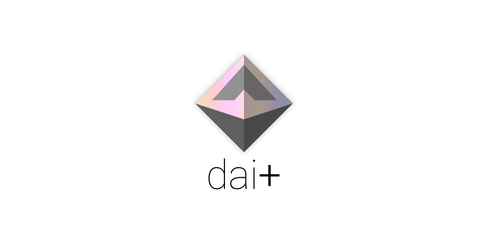

  

### What is `dai+`

`dai+` is a simple wrapper that adds useful meta-transaction features by following the erc-2280. dai+ can be sent and received, but also provides utility to `unwrap and transfer` or `wrap and transfer`. of course, it also follows the erc-20 standard.

### Status

| Service | Status |
| :---: | :---: |
| Coveralls |  |

